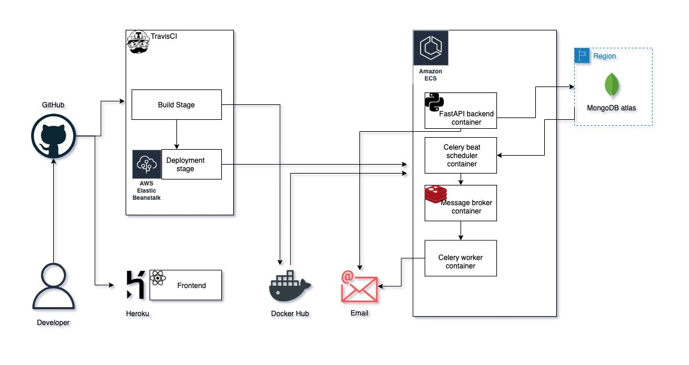

# GetvaccIndia

A bot to search and send email notification for available vaccine slots near your area in India

---

## Architecture


## Quick start

Account setup

1. Create an account on [mongodb atlas](https://www.mongodb.com/cloud/atlas)
3. Create a database and collection in mongodb atlas. whitelist your system's IP from the atlas console.
2. Create a gmail account or any SMTP service to [send emails](https://kb.synology.com/en-global/SRM/tutorial/How_to_use_Gmail_SMTP_server_to_send_emails_for_SRM)

Developer setup

1. Clone the repo using git.
2. Rename the [.env.example](backend/app/.env.example) -> `.env`
3. Add values to the variables in the `.env` file
4. `cd` into the clonned repo and paste ```$ docker-compose -f docker-compose-dev.yaml up``` on the terminal.
*note*: You would need [docker](https://docs.docker.com/get-docker/) and [docker-compose](https://docs.docker.com/compose/install/) installed.
5. You can access the UI at `localhost:3000` from your browser.
6. You can access the swagger docs at `localhost:8004/docs` from your browser.

---

## License
[MIT License](LICENSE)
